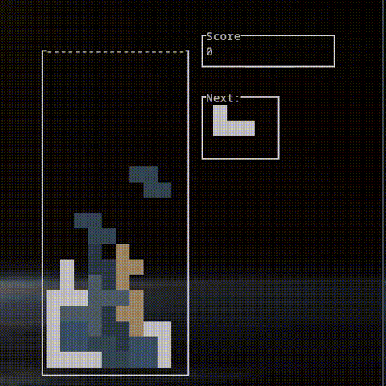

# Tuitris


## Dependencies
A local installation of ncurses is required for rendering. Packages should be available on any package manager.

E.g: On Arch Linux:
```
pacman -S ncurses
```

## Build from source
Clone the repository locally:
```
git clone https://github.com/rory-self/tuitris.git
```

Build the project using CMake in the cloned directory:
```
cd tuitris
cmake -B build
make -C build
```

Run the compiled binary:
```
./build/tuitris
```
